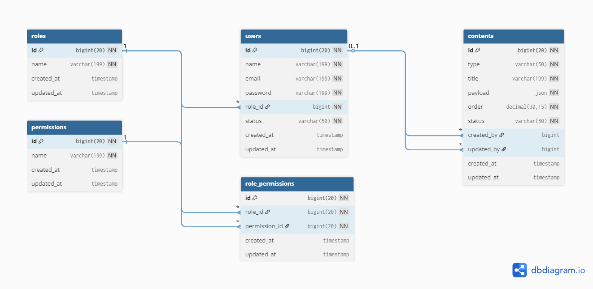

# LaraCMS

This project is a **Dynamic Content Management System (CMS)** designed to support multiple content types such as **text**, **banners**, and **cards**.  
It includes advanced **ordering**, and **Bulk ordering** features for flexible content administration.

## Setup Instructions

1. **Clone the repository:**
    ```bash
    git clone https://github.com/abdulmajidcse/laracms.git
    cd laracms
    ```

2. **Install dependencies:**
    Create a database like `laracms` and another one is `testing` if you want to run test. Actually follow db information in .env.example file.
    Open your .env.example and update your db information if needed.
    ```bash
    composer run setup
    ```

3. **Start the development server:**
    ```bash
    composer run dev
    ```
    Now, visit http://localhost:8000.
  - API base url: http://localhost:8000/api/v1
    
### [View API Documentation](https://documenter.getpostman.com/view/17226874/2sB3QNqogy)


---

## 📖 Case Study

The main challenge in this application is **content ordering**.  
A well-designed ordering mechanism ensures that content appears in the correct sequence while allowing administrators to reorder efficiently.

### ⚙️ Key Challenges
- Each content item must have an **order value** that defines its display position.  
- Support **dynamic reordering** of content items.  
- Handle **order conflicts** (e.g., two items assigned the same position).  
- Allow **flexible and consistent reordering** without breaking the sequence.  
- Support **bulk reordering** of multiple content items.

The goal is to provide an optimized and user-friendly solution that ensures seamless content arrangement across different content types.

---

## 🧠 Design Overview

The CMS uses a single `contents` table with fields like `type`, `title`, `payload`, `order`, and `status`.  
This structure provides flexibility to manage different content types without modifying the database schema.  
Dynamic ordering is handled via a dedicated **ContentOrder** service that maintains consistent sequence values.

---

## 🧩 Application Modules

- 🔐 **Authentication** – Admin accounts for secure access.   
- 🧱 **Content Management** – CRUD operations for various content types.  
- 🔢 **Content Ordering** – Support for both single and bulk reordering of content items.

---

## 🔢 Content Ordering System

The **Content Ordering** system is one of the core features of the Dynamic Content Management module.  
It ensures that all content items (such as text, banners, or cards) appear in a defined and consistent order on the website.

This system supports two key features:
- **Single Ordering**
- **Bulk Ordering**

---

### 🧩 Single Ordering

In **single ordering**, each content item is assigned a unique numeric value in the `order` column.  
When a new content item is created, the system automatically calculates its order value using a defined gap (e.g., 1 or 5).  
This ensures that new items always appear at the correct position without breaking the existing sequence.

#### Key Points
- Each content item has an `order` field (e.g., 1, 2, 3, ...).  
- The order value determines how contents are displayed on the frontend.  
- When a new content is added, the system finds the current maximum order and assigns the next available number.  
- Reordering a single item adjusts only the affected record.

#### Example
| ID | Title         | Order |
|----|----------------|-------|
| 1  | Home Banner    | 1     |
| 2  | Welcome Text   | 2     |
| 3  | Featured Card  | 3     |

If you move “Welcome Text” below “Featured Card”, its order becomes **3.5** or **4**, depending on your chosen gap strategy.

---

### ⚙️ Bulk Ordering

**Bulk ordering** allows multiple content items to be reordered at once — especially useful for drag-and-drop interfaces in admin panels.  
Instead of updating one item at a time, the system updates all selected records in a single operation.

#### Key Points
- Accepts a list of content IDs with their new order values.  
- Validates all order values to prevent conflicts or duplicates.  
- Performs a single bulk update query for optimized performance.  
- Ensures ordering remains consistent across all affected items.

#### Example Input (API Payload)
```json
{
  "prev_content_id": 3,
  "reorder_content_ids": [6, 5, 7],
  "next_content_id": 8
}
```

### 🔄 Reorder API Scenarios

The reorder API accepts `prev_content_id`, `reorder_content_ids`, and `next_content_id` to determine where to position content items.  
Below are examples of how each combination works.

---

#### 🧩 1. With Both `prev_content_id` and `next_content_id`
Moves the selected items **between** two existing contents.

```json
{
  "prev_content_id": 3,
  "reorder_content_ids": [5, 6, 7],
  "next_content_id": 8
}
```

You may remove `prev_content_id`, `next_content_id` or both at once. If you remove, system will automatically detect start and end position.

## 🚀 Goal

Deliver a **robust, scalable, and easily maintainable CMS** where content can be dynamically arranged and managed without technical complexity.

---

## 🗃️ Database Schema (Using dbdiagram.io)

The following schema illustrates the database structure used in the Dynamic Content Management System.



---

## Thank you!